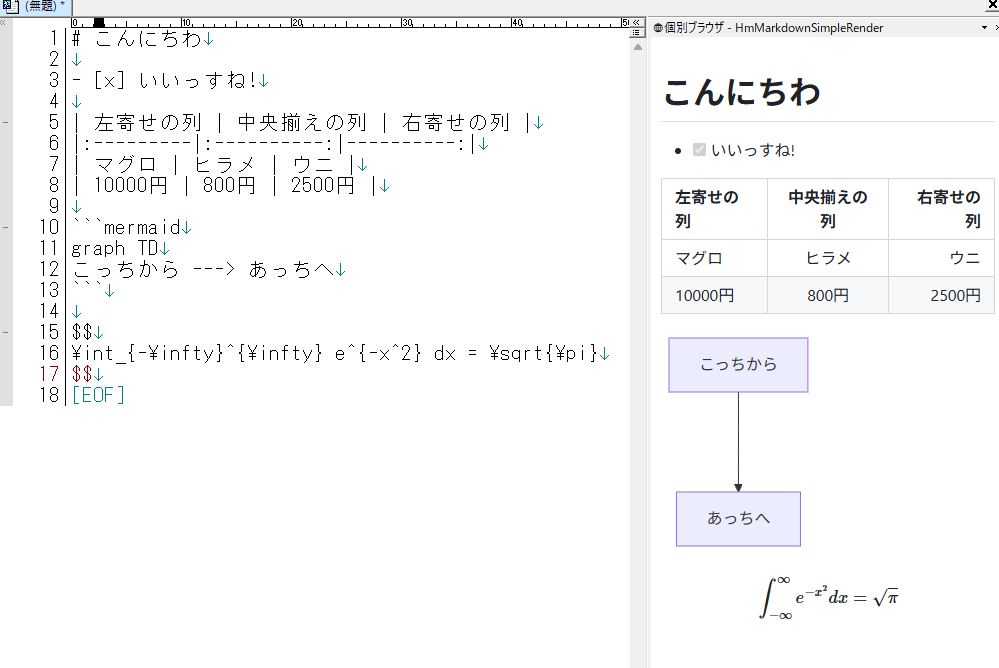

# HmMarkdownSimpleRender

秀丸上で「Markdown / Mermaid / MathJax」に対応したリアルタイムレンダリングビュー。  
主に「対話AIの返答」や、「Github等のMarkdown」をコピペでレンダリング表示するためのコンポーネント。

https://秀丸マクロ.net/?page=nobu_tool_hm_custom_render_browser_all_render